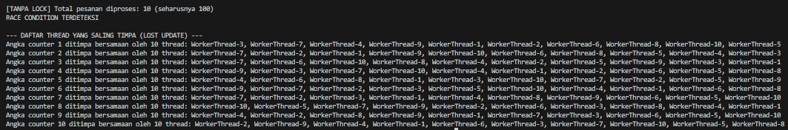
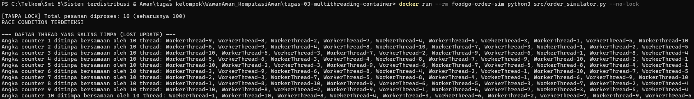
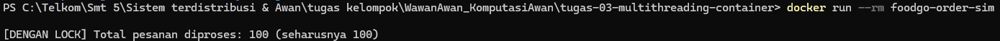

# Jurnal Proses — Tugas 3

## Percobaan tanpa Lock
- Hasil `processed_count` yang didapat: 

- Kenapa bisa meleset (jelaskan mekanisme race condition dengan kata sendiri): Dari yang ada di code, ketika nilai processed_count dibaca oleh satu thread, nilai tersebut bisa langsung berubah oleh thread lain sebelum thread pertama selesai memodifikasinya. Mirip kayak proses timpa-menimpa. Tanpa lock, ketika ada satu thread yang ingin melakukan read and write, maka ada kemungkinan jika thread lain akan melakukan proses read and write pada data yang sama, sehingga write dari thread lain dapat ditimpa oleh thread kedua. 

## Percobaan dengan Lock
- Hasil `processed_count` setelah perbaikan: 

## Kenapa threading bukan proses yang berat
- Dari studi kasus pada tugas satu dan dua, kita dapat melihat jika server yang tersedia memiliki resource yang sangat terbatas dan jika terus menggunakan fork() seperti pada simulasi tugas pertama maka akan sangat menghabiskan resource server dan tidak efisien, hal itu disebabkan karena setiap proses baru memiliki salinan memorinya sendiri. Oleh karena itu, digunakan multithreading sebagai alternatif karena thread berjalan dalam satu proses dan dapat berbagi resource seperti memori, sehingga overhead (biaya penggunaan resource untuk menjalankan dan mengelola thread/proses) yang digunakan lebih kecil dibandingkan membuat proses baru untuk setiap pesanan. Dengan menggunakan multithreading, beberapa pesanan juga dapat diproses secara konkuren tanpa harus membuat proses baru untuk setiap pesanan.

## Kendala Dockercl
- Error yang ditemui saat `docker build`/`docker run` dan cara memperbaikinya: Tidak terjadi error ketika docker build ataupun docker run

- Percobaan docker tanpa lock: 
- Percobaan docker dengan lock: 

## Log Penggunaan AI (Level 2)

> Wajib diisi sesuai kebijakan Level 2 di [`../RUBRIK-UMUM.md`](../RUBRIK-UMUM.md). Tulis "Tidak memakai AI" pada baris pertama jika memang tidak dipakai. Hanya untuk brainstorming ide/outline — bukan untuk kode/analisis/teks akhir.

| Tanggal | Tool AI | Prompt yang diberikan | Ringkasan saran/ide AI | Bagaimana diolah jadi tulisan/kode sendiri |
|---|---|---|---|---|
| 9/30/2026 | Chatgpt | Apakah fork dapat membebani server kalau arsitektur dan resourcenya sudah diperbaiki agar gak seburuk studi kasus? | Penggunaan fork() tidak selalu membebani server secara berlebihan. Namun, pada studi kasus dengan resource terbatas dan banyak request secara bersamaan, pembuatan proses baru untuk setiap request dapat meningkatkan penggunaan resource dan overhead. Dengan arsitektur yang lebih baik seperti process pool atau server dengan resource yang memadai, penggunaan proses masih dapat menjadi pilihan yang sesuai. | (Kebutuhan brainstroming, belum diketik) |
